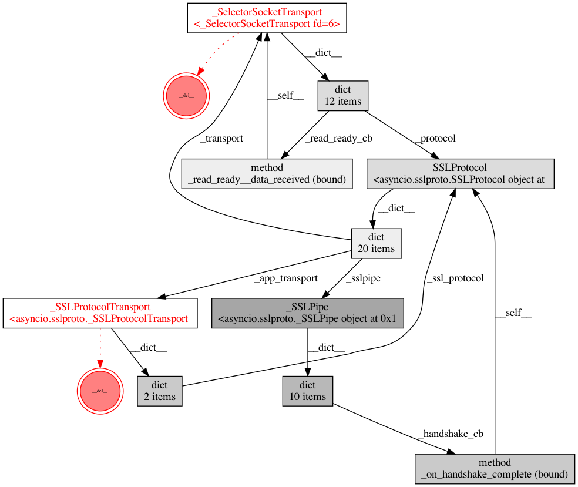

# bpo-37658

A research on [bpo-37658](https://bugs.python.org/issue37658).

## An example to reproduce

Steps:

* Start server: `python server.py`
* Run client: `python client.py`
* If needed (no exceptions seen in client's output), tweak `timeout` and/or raise number of attempts in `test_cancel()` function

On success the output should be like:

    Fatal error on SSL transport
    protocol: <asyncio.sslproto.SSLProtocol object at 0x10156faf0>
    transport: <_SelectorSocketTransport closing fd=13>
    Traceback (most recent call last):
    File "~/.pyenv/versions/3.9.4/lib/python3.9/asyncio/selector_events.py", line 918, in write
        n = self._sock.send(data)
    OSError: [Errno 9] Bad file descriptor

    During handling of the above exception, another exception occurred:

    Traceback (most recent call last):
    File "~/.pyenv/versions/3.9.4/lib/python3.9/asyncio/sslproto.py", line 684, in _process_write_backlog
        self._transport.write(chunk)
    File "~/.pyenv/versions/3.9.4/lib/python3.9/asyncio/selector_events.py", line 924, in write
        self._fatal_error(exc, 'Fatal write error on socket transport')
    File "~/.pyenv/versions/3.9.4/lib/python3.9/asyncio/selector_events.py", line 719, in _fatal_error
        self._force_close(exc)
    File "~/.pyenv/versions/3.9.4/lib/python3.9/asyncio/selector_events.py", line 731, in _force_close
        self._loop.call_soon(self._call_connection_lost, exc)
    File "~/.pyenv/versions/3.9.4/lib/python3.9/asyncio/base_events.py", line 746, in call_soon
        self._check_closed()
    File "~/.pyenv/versions/3.9.4/lib/python3.9/asyncio/base_events.py", line 510, in _check_closed
        raise RuntimeError('Event loop is closed')
    RuntimeError: Event loop is closed

## Circular references when using SSL/TLS

Steps:

* Install [objgraph](https://pypi.org/project/objgraph/)
* Start server: `python server.py`
* Run client: `python ssl_circular_refs.py`, expected result: the error message as above
* Uncomment the line `culprit_types.reverse()` and run client again, expected result: no error

As side affect this example produces te following graph of references between culprit objects:

The example is tuned to get reproducable order of destructor calls to show that we get the error with one order and don't with other.
